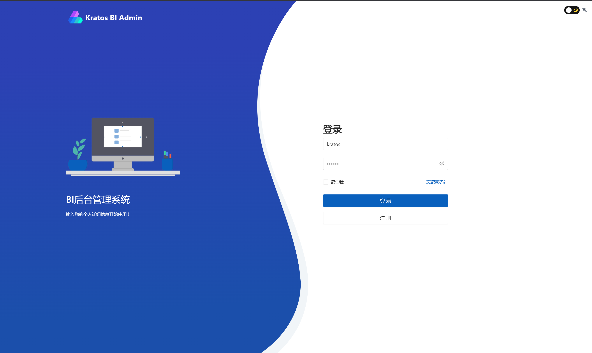

# 克拉托斯用户行为分析系统 - 后台管理系统 - Kratos UBA Admin

一个Golang的UBA。

- 后端基于 [golang](https://go.dev/) + [go-kratos](https://go-kratos.dev/)
- 前端基于 [VUE3](https://vuejs.org/) + [TypeScript](https://www.typescriptlang.org/)

## 技术栈

- [TypeScript](https://www.typescriptlang.org/)
- [Vite](https://vitejs.dev/)
- [Vue3](https://v3.vuejs.org/)
- [Pinia](https://pinia.vuejs.org/)
- [Ant-Design-Vue](https://2x.antdv.com/docs/vue/introduce-cn/)
- [Vben Admin](https://vben.vvbin.cn/#/)

## 安装使用

- 安装依赖库

```bash
pnpm install
```

- 运行

```bash
pnpm serve
```

- 编译

```bash
pnpm build
```

## API & Mock

使用国产货Apifox来做API管理和Mock Server

- API地址：<https://apifox.com/apidoc/shared-33e9455b-f977-4dea-a63d-bc48e88d1da0>
- Mock地址：<https://mock.apifox.cn/m1/2980293-0-default>

## 后台截图

- 登陆界面


